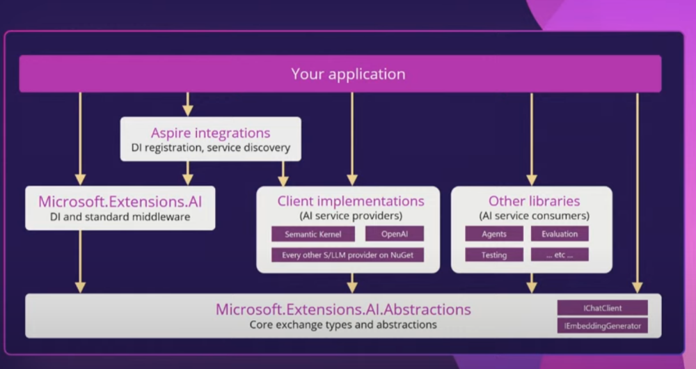

# .NET9 重点更新内容概要

每个.NET版本相关的类库都会更新很多内容，.NET9也不例外。在这篇文章中，我将会介绍一些离开发者更近的一些内容。

## 性能更新

性能更新是每个版本的固定内容，.NET9也不例外。但是我不会在这里详细介绍，因为官方的博客中`Stephen Toub`已经做了详细的介绍，[点此查看官方博客](https://devblogs.microsoft.com/dotnet/performance-improvements-in-net-9/)。

## 功能性更新

除了性能的改进，SDK中也更新了一些方法的使用，有的是性能改进，有的是易用性改进，有的是新增的方法，这里也不一一介绍，大家可以参考下图，你可以根据名称再搜索具体的更新内容。


这里我个人比较关注的是`Guid V7`，它可以根据时间生成有序的`Guid`，这在使用`PostgreSQL`和`MySQL`数据时，生成有序的ID是非常有用的。如果使用的是`SQL Server`，`EF Core`之前版本的值生成会自动帮你生成有序的ID。

升级到.NET9，你可以在客户端部分使用`Guid V7`生成Guid，以保持有序性。

> [!NOTE]
> 由于`EF Core9.0`是基于`.NET8.0`的，所以如果你不显式的在客户端使用`Guid V7`，那么EF Core9.0并不会自动生成有序的ID，这要等到.NET10.0(SQL Server除外)。

除此之外，还有一些功能上的更新，如

- LINQ：新增 CountBy 和 AggregateBy 方法，简化了按键聚合状态的操作。
- 加密：新增一次性哈希方法和使用 KMAC 算法的新类。
- 反射：新增 PersistedAssemblyBuilder 类型，允许保存已发出的程序集，并支持 PDB。
- TimeSpan：新增 From* 方法，允许从整数创建 TimeSpan 对象，避免浮点计算的误差。

完整的功能更新可以查看官方文档。

## ASP.NET Core

对于我个人来说，比较关注ASP.NET Core相关的内容，因为这是我最主要使用的部分。但是在.NET9中，我关注的两个点，都还只是在预览阶段，也有些许问题，以致于无法在生产环境中使用。

### HybridCache

`HybridCache`是一个新的缓存方案，它结合了`MemoryCache`和`DistributedCache`的优点，可以在本地缓存和分布式缓存之间进行切换。直接目前还是在预览阶段，之前我在自己的项目模板中集成时，遇到了一些问题，具体问题忘记了，总之，目前不太适合用在生产环境中。

### Microsoft.AspNetCore.OpenApi

当前我一直使用的是`Swashbuckle`，遇到的主要问题是在项目接口和模型很多时，每次获取swagger json内容，可能要等待很长时间，大概要20s+。

在.NET9中，官方提供了`OpenAPI`的集成，同时可以直接使用`OutputCache`输出缓存来解决上述问题，不需要每次获取swagger json都重新生成。

虽然该类库9.0版本提供了稳定的包，但欠缺了一个十分重要的功能，让我不得不放弃使用它，那就是它目前不支持从`XML注释`中获取`Swagger`的描述信息，这就相当于我所有代码中的注释都没有意义了，这是没法接受的，而该功能需要在.NET 10中才会支持。

至于其他的更新，比如`Blazor`，`EntityFramework`等，要么是我基本不怎么使用，要么就是什么值得关注的内容，所以这里就不再一一介绍了。

## C# 13

关于语言特性，其他大家可以从官方文档中查看，近两个版本的更新，更多的是易用性上的更新。我相信可能很多开发者连C#12中的特性可能还没怎么用上。在C#12中，有两个语言上的特性，我基本上在代码中已经广泛使用了：

### 数组初始化

可以直接使用`[]`来初始化数组，不需要`new`关键字。

代码示例：

```csharp
public List<string>? Tags { get; set; } = [];
public ICollection<FileData> Files { get; set; } = [];
public string[] Names { get; set; } = [];
```

### 主构造函数

一开始我对该特性是没有什么感觉的，但在ASP.NET Core中，由于广泛的使用依赖注入，我发现自己的很多类，都可以使用主构造函数来简化代码。简化代码不仅意味着代码行数更少，也意味着，你手动编写代码时花的时间也更少了。

代码示例：

```csharp
public class CustomerRegisterManager(
    DataAccessContext<CustomerRegister> dataContext,
    DingTalkWebhookService dingTalkWebhookService,
    ILogger<CustomerRegisterManager> logger,
    CacheService cache,
    SmsService sms,
    IUserContext userContext) : ManagerBase<CustomerRegister, CustomerRegisterUpdateDto, CustomerRegisterFilterDto, CustomerRegisterItemDto>(dataContext, logger)
{
    private readonly CacheService _cache = cache;
    private readonly IUserContext _userContext = userContext;
    private readonly SmsService _sms = sms;
    private readonly DingTalkWebhookService _dingTalk = dingTalkWebhookService;
}
```

在有很多要注入的服务时，主构造函数的优势就更加的明显。

### C#13的更新

C#13中，主要根据设备了`params集合`，`新的Lock类型`，`模型匹配增加`等功能。

完整更新内容可以从[官方文档](https://learn.microsoft.com/zh-cn/dotnet/csharp/whats-new/csharp-13)中查看更多的更新内容。

在这次更新中，提到了之前就有提到过的`The field keyword`，不过还是预览状态，这个更新是有可能会影响到我们的代码风格的，所以我觉得还是值得关注的。

现在我们需要一个`back field`，用来存储属性的值

```csharp
public int PageIndex
{
    get => _pageIndex;
    set
    {
        _pageIndex = value;
        if (value < 1)
        {
            _pageIndex = 1;
        }
    }
}
```

以后可以省略`back field`字段，直接使用`field`关键字

```csharp
public int PageIndex
{
    set
    {
        field = field;
        if (value < 1)
        {
            field = 1;
        }
    }
}
```

## 其他的更新

### NET CLI

命令行工具也有所改进，在开发体验有所提升，如：

- 终端日志记录器：默认启用并改进了可用性。
- 单元测试：更好的 MSBuild 集成，允许并行运行测试
- 工具改进：dotnet tool install 命令新增选项，允许用户决定工具是否可以在比目标版本更新的 .NET 运行时版本上运行
- `dotnet publish`现在支持`http`协议的`docker registry`了。

至于`MAUI`,`Blazor`,`.NET Aspire`等相关内容，没有什么特别值得一提的更新，感兴趣的可以自行查找，这里简单概括下：

- MAUI支持更新的平台，以及部分控件更新
- Blazor稳定性和性能上有所提升，`Fluent UI`现在也支持Blazor了
- .NET Aspire，首先是Dashboard的细节完善，其次是对更多组件的支持。你可以用几行代码就可以在本地运行大语言模型。
-

### AI方面的更新

微软对AI的支持力度是很大的，这主要体现在：

- OpenAI SDK的.NET类库
- ML.NET类库
- Semantic Kernel
- ONNX Runtime

这一次，微软发布了`Microsoft.Extensions.AI.*`系列包，为开发者带来更加统一的开发体验。可以通过一张图展示它的作用：



类似于`EF Core`，微软提供一个统一的接口，其他的大语言模型实现接口，通过`provider`的形式提供给开发者。

## 我的建议

我尝试将我的项目更新到.NET9的，但由于上面说的各种原因，最终我还是将目标框架设置为了`NET8`，虽然目标框架是.NET8，但仍然可以使用很多`9.0`的包，它们都兼容.NET8。不过有一个例外：`Microsoft.AspNetCore.Authentication.JwtBearer`这个包，不兼容.NET8。

能否升级.NET9，一个前提是**你依赖的类库都能够支持.NET9**，在此前提下，如果你

- 是类库的开发者，且追求极致的性能和内存优化
- 你的应用大规模部署，想通过提高性能和减少内存占用来减少成本
- .NET9中提供了你需要的新特性

那么你可以考虑升级到.NET9。

✨ 我的建议是，先安装.NET9 SDK，以享受在cli方面的一些改进，至于项目要不要以.NET9为目标，根据个人情况来定。
