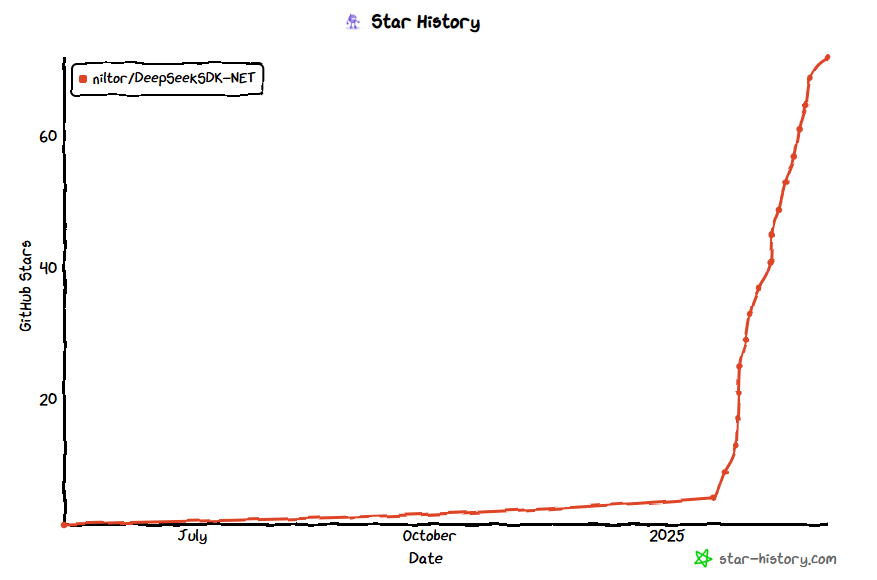

# DeepSeek API的使用经验分享

DeepSeek在最近几个月可谓是风头无两，在各种场合谈到大语言模型时，它总会随着`OpenAI`一起被提及。作为一个开发者和实际的用户，不同于所谓的各种外行自媒体，分享一下实际的使用经验。

## 背景

去年在做`ater.dry.cli`项目时，就尝试将大语言模型的能力集成到项目中，不过一直没有找到很具体的结合点，当时就尝试对接API，在前端页面以聊天的方式进行交互。然后就选择了`DeepSeek API`，也就有了后续的`DeepSeek.NET SDK`开源项目。

## 为什么选择DeepSeek

大语言模型有很多，而DeepSeek的一些优势让我选择了它：

- 由于网络及其他限制问题，`OpenAI`的API作为首要的备选方案，而不是首选方案。
- DeepSeek API服务非常容易获得，只要注册账号即可使用，并且有免费额度，零成本上手。而其他的服务可能 中是作为云服务的其中一部分，申请使用的步骤繁琐复杂。
- 价格非常便宜，可以说是国内最早最便宜提供API服务的提供商之一。
- 效果达标，这是所有的前提，如果效果不好，其他都是浮云。
- 不限并发(很大的优势)。

> [!NOTE]
> 早期V1版本，会遇到一些问题，如要求返回`Json`时，偶尔会出现格式错误的情况。不过这个问题在后续模型中得到缓解，后续版本中也可以明确指定返回Json格式。

## DeepSeek.NET SDK

要将DeepSeek API集成到项目中，我们需要通过`HTTP`请求来调用API，我首先使用了`Open AI`的`C#`SDK，当我使用其`Stream Chat`功能时，会发现`DeepSeek`流式输出的格式与`Open AI`的并不一致，而在SDK层面上又无法自定义处理过程，当时`Nuget`上也没有相应的包，所以我只能自己实现。

### 第一个版本

第一个版本(v1.0.x)大概在2024年5月份就发布到nuget上了，主要是实现了`Chat`功能，包括流式的处理，满足自己在项目的使用场景。

包括后续我在帮朋友做一个`AI文案改写`的功能时，就直接使用了该`SDK`，也没有做大的改动。

### DeepSeek的突然爆火

在2024年底，我在朋友的项目中正在使用`DeepSeek API`做业务端测试，每天都要花费几十万的`token`，它的并发优势，在我们的场景中具有独特的优势，大大减少了等待时间。

很快，`DeepSeek-R1`在春节前发布了，以`开源推理模型`和`低训练成本`让`DeepSeek`短时间内在外网上爆火，我对这种`短时间内大量传播`的现象向来是不以为意的，它不符合基本的传播规律，都是人为推动的结果。而当时国内正处在`春节`前期，都在忙着准备过节，倒没多少传播。直到我发现有人在我的`github`项目中开始提`issue`，而且还是国外的用户，并且`star`的数量也在缓慢增加。为了解决相关的问题，我再一次更新了`SDK`，花了两天多的时间，将`DeepSeek API`提供的功能，整体都在SDK中实现了，并在后续的版本添加了对`ASP.NET Core`的支持，并完善和修复了一些问题，并提供了更加详细的使用示例。在春节及后续一段时间，`star`的数量也开始逐渐增多。

而在`Nuget`上，由于先发优势，也是下载量最多的`DeepSeek SDK`包。在一些介绍`DeepSeek .Net SDk`的文章中，大部分也会提到我的开源项目。

### 爆火背后的问题

`DeepSeek-R1`的热度在国外也就持续了一周左右的时间，更多国外的用户是拿`DeepSeek-R1`来diss`OpenAI`，想让`OpenAI`推出更强大更便宜的模型。并且`DeepSeek`很快也就丧失了提供`服务`的能力，其官方聊天和API都受到了极大的影响，几本处于`无法使用的`情况。

在春节过后，节前的项目开始出现问题，`超时`成为了常态。在`文案改写`的场景中，过去我们仅需要**30s**就能完成的工作，现在快的时候需要`2分钟`，慢了时候甚至需要`5分钟`，已经完全不符合业务需求了，于是我们不得不弃用了`DeepSeek API`，并开始使用`混元`以及`火山`提供的模型。

在国内各种炒作的背景下，对于实际的`DeepSeek`使用用户来说，其实是非常尴尬的，服务不可用，超时等问题持续了整整一个月的时候，这对于任何一个对外提供API服务的公司来说，其实都是非常致命的。`DeepSeek`在方面上的表现，实在是有很大的差距。

从最近 `DeepSeek`官方推出的`闲时计费`服务上来看，其主要压力还是在于`国内`的访问上，而不是所谓的`黑客`攻击。因为`黑客`攻击是所有服务商都会面临的问题，在后端中，限流，防火墙等安全措施都是基本操作，这不是`服务瘫痪`的主要原因。

### 恢复服务

现在，官方服务终于恢复了，具体效果，后续我会再次测试，看看是否能够恢复到之前的水平。

从这一系列的事件中，`DeepSeek`本身有多少受益或损失，只有他们自己知道，但我们可以看到一些基本的事实：

- DeepSeek的名字响彻全球
- DeepSeek的开源模型被大量使用
- DeepSeek 长达一个月的时间里无法提供正常的服务，其服务的使用者受到严重的影响
- 大量闻名而来的用户，被官方的"瘫痪"所影响，体验很不好
- 国外的模型和服务在这一波"冲击"下得到了快速的进步
- 国内外不少人疯狂炒作，并借着`Deepseek`的热度，充实了自己的钱包

## 总结

最后，我想从用户的角度分享一下看法

- 长达一个月的恢复时间，对于一个提供在线API服务的公司来说，是非常致命的，尤其是被外界疯狂炒作的情况下。
- 一定要对接至少两个及以上大语言模型服务，以备不时之需。
- 前期DeepSeek的低价格，不限并发的优势，已经越来越弱了。

DeepSeek在工程上的创新和应用，让其以更低的成本和效率，训练和运行大语言模型，在资源有限的情况下，是非常有价值的。

但在最火的时候，确没能拿出可靠的服务，这是一个很大的挫败，也许DeepSeek本身也没想到会突然爆火，或者说，那些炒作的人，并没有给DeepSeek本身带去什么实质的好处，反而让其瘫痪了。

相比其他公司的大量宣传和炒作，包括近期的某`XX元宝`，到处都是其广告，`DeepSeek`一直都非常低调，即便在这波`DeepSeek`热度中，官方没有借机宣传或吹嘘，没有贬低拉踩其他公司，没有强调"自研"，也没有“字研”创造各种名词；他们在按自己的节奏发论文，分享技术细节和开源相关工具，这是踏踏实实做事的样子。作为用户，我们希望能够使用到更加智能、稳定、便宜的服务，至于其他的，都是浮云。
