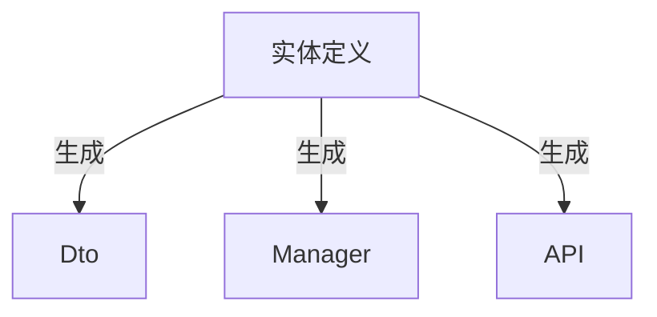
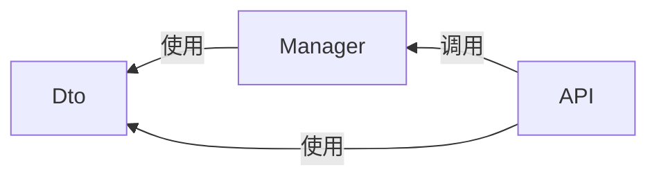

# 入门必读

本篇内容介绍Ater.Dry.Copilot是什么，它的作用和目的是什么，你是否需要它，以帮助你快速做出决策。

## Ater.Dry.Copilot是什么？

从技术角度来讲，它就是一个`dotnet tool`工具，通过`nuget`包管理器进行分发。

从功能角度来讲，它提供了：

- 解决方案模板：提供完整的解决方案模板，包含了所有必要的项目和配置，在此基础上快速完成业务开发。
- 几个简单的命令：用来启动WebUI、MCP Server、以及生成代码。
- WebUI：提供了一个Web界面，以便用户可以通过UI来管理和使用Ater.Dry.Copilot的所有功能。
- MCP Server：提供了一个MCP Server，以便用户可以在IDE中充分使用AI能力来生成代码。

简单来说，在提供一个解决方案模板的基础上，通过代码生成的方式，帮助用户快速完成业务开发。

## Ater.Dry.Copilot的作用和目的是什么？

简单来说，它的作用是解决在开发过程中的几个痛点：

- 每个项目从零开始，需要花费大量时间和精力来配置和搭建基础设施。
- 在一个良好的架构基础上，对于常见的业务和接口实现(如CURD操作)，有很多相似且重复性的工作。
- 客户端与服务端的对接，需要花费大量的沟通时间和精力来保持一致性。
- 缺乏规范的代码结构和规范，导致代码越写越乱，难以维护和扩展。

在此基础上，还提供自定义代码生成功能，以及提供MCP Server，直接在IDE中使用自然语言方式生成代码。

它的目的，是为了提供一套基础框架和工具，帮助开发者快速开发后台服务和前端应用，主要目标：

- 提高开发体验 (对自己好一些)
- 加快开发速度 (对公司好一些)
- 编写易维护的代码 (对他人好一些)

最终的效果是：**开发者用的舒心，代码写的开心，业务得以快速实现，降低成本和风险。**

## 你是否需要Ater.Dry.Copilot？

虽然我们尽可能使用主流和通用的技术来解决大部分问题，但仍然有一些特定的场景和需求，可能不适合使用Ater.Dry.Copilot。

如果你是以下情况之一，Ater.Dry.Copilot可能无法满足你的需求：

- 必须使用Minimal API或AOT。
- 不接受使用Entity Framework Core作为ORM。
- 一定要实现某种设计模式(TDD/DDD/CQRS等)。
- 不接受`Code First`的。
- 不接受使用`Guid`作为主键的。
- 不接受使用`DateTimeOffset`作为时间存储类型的。

简单解释一下:

- 我们默认使用`Controller`来定义API接口，代码生成也是生成基于`Controller`的代码，而`MVC`目前无法支持`AOT`。
- 我们默认使用`Entity Framework Core`作为ORM，并优先使用`Code First`的方式来定义数据库模型。
- 我们使用代码生成来简化开发流程，而不是要求开发者必须遵循某种特定的设计模式或理论，当然也并不限制。
- 无论是EF Core还是.NET Aspire，或是代码生成功能，都是`Code First`的体现。
- 我们默认使用`Guid`作为主键，

总结来说，使用默认的模板结构及相关技术，可以最大程度利用内置的代码生成功能提高开发效率。

> [!NOTE]
> 项目模板本身只是一个ASP.NET Core Web Api项目，本质上并不限制使用任何库或使用任何开发或设计模式，为了避免项目变得过于复杂和难以维护，我们会选择一些通用且高效的方案应用到项目开发中，并且内置默认选项的代码生成功能。

> [!IMPORTANT]
> 你可以通过自定义代码生成的方式来实现基于其他ORM和设计模式的生成功能，从而完全绕开内置的生成功能以及项目结构，但这需要你自己去配置和探索，并且因此带来的技术问题需要自己去解决。请参考高级目录中的[在现有项目中使用工具](./高级/在现有项目中使用工具.md)。

## 核心思想

在面向对象的编程中，我们对现实或抽象事物进行建模，通过编写类和接口来定义事物，以及这些事务之间的关系。无论是业务逻辑还是数据访问，无论是后端服务还是前端应用，都是围绕着这些事务展开的。

### 以实体为业务核心

所以实体的定义是我们开发的中心和起点，逐渐扩展到代码的各个方面。

而我们的代码生成功能，就是使用`Roslyn`来分析和理解这些实体，然后生成其他的代码，如Dto的定义，数据库的查询，接口服务的定义等。

在前后端交互以及服务之间的通信中，`OpenAPI`提供了描述这些接口的能力，可以通过它生成各种语言的客户端代码。

这意味着，我最初始在实体中定义的名称，注释及其他特性等信息，应该能够贯穿到整个代码生成的过程中，从而保持一致性，避免重复和错误。

### 以代码为开发核心

也许有人会有疑问，这不是废话么，开发当然以代码为核心。在实际开发中，除了代码之外，我们可能还会：

- 环境的搭建、配置、调试、测试
- 写SQL或YAML、JSON等配置文件
- 编写文档
- 与客户端多次沟通对接接口内容

而这些“代码外”的工作，往往会占用大量的时间和精力。

我们希望能够回归本源，专注于使用代码来实现业务逻辑，尽量减少其他的工作。所以我们推荐：

- 使用Entity Framework Core来简化数据库操作，包括使用`Code First`的方式来定义数据库模型，而不是手动编写SQL脚本。
- 使用`.NET Aspire`来简化服务的配置和管理，包括使用容器化的方式来运行服务，而不是手动配置和管理服务。
- 项目模板提供常见服务的配置和功能封装，如缓存、数据库、消息队列等，开箱即用。
- 通过代码生成以及自定义生成模板任务来简化甚至自动化一些模板代码的编写和维护工作。

### 简化开发模型

我们将后端的编程过程概括为以下几个步骤：

- 定义：如实体和Dto的定义
- 实现：业务逻辑实现(Manager)，如数据库/缓存/消息队列/第三方服务等等跟业务相关的内容。
- 接口：指定义RESTful API，通过OpenAPI等工具与其他客户端或服务保持一致。

其关系如下：

Dto/Manager/Controller之间的关系：

代码生成功能可一键生成以上内容，完成简单的CURD功能，并提供可用的API。开发者可在此基础上进行修改和扩展。

### 以结果为导向

我们尽量避免讨论设计模式或开发模式等概念或理论。因为我们不是面向设计模式或概念编程，而是面向客户需求且以业务结果为导向。

简单说，能不能快速的满足客户需求，能不能快速的实现业务目标是首要的评估因素。

但不要误解，快速不意味着生产屎山代码，相反，屎山代码会大大降低开发效率和质量。快速意味着在一个良好的架构和规范的基础上，通过工具快速生成规范的代码，然后在此基础上专注于业务逻辑开发，而避免将时间花在争论设计模式或概念上。
