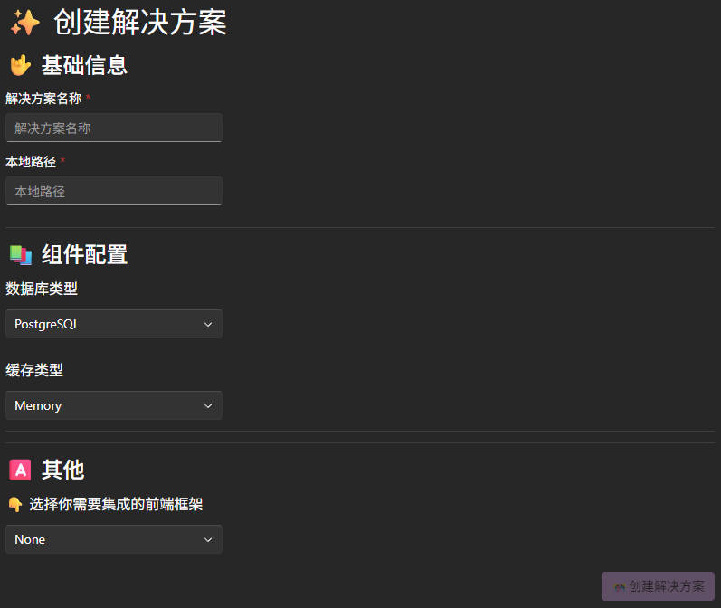
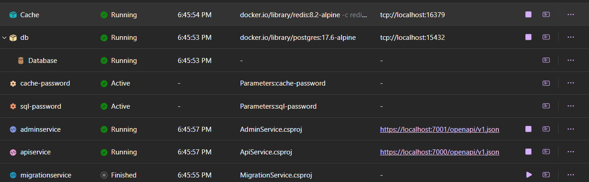

# 快速入门

本篇文章帮助您快速创建和运行项目。

## 前提条件

1. 安装`.NET 10`或更高版本的SDK。
2. 安装`Docker Desktop`或`Podman`。
3. IDE支持`.NET Aspire`组件。

具体要求请参考[.Net Aspire Setup](https://learn.microsoft.com/en-us/dotnet/aspire/fundamentals/setup-tooling?tabs=windows&pivots=visual-studio)。

## 安装工具

使用`dotnet tool`命令安装`Ater.dry.copilot`工具。

```powershell
dotnet tool --install Ater.dry.copilot --version 10.0.0
```

版本请以`nuget.org`上的最新版本为准。

## 创建解决方案

首先打开Studio，执行以下命令，以在浏览器中启用管理界面。

```powershell
ater studio
```

点击`创建解决方案`按钮，进入创建解决方案的界面。



输入相关信息后，点击`创建解决方案`按钮，等待创建完成。

## 运行项目

### 创建数据库迁移

还差一步，我们就可以运行项目了，现在我们已经有了数据库，现在要生成迁移脚本，

在根目录`scripts`下，可调用`EFMigrations.ps1`脚本来执行数据库的迁移，如

```powershell
.\EFMigrations.ps1 Init
```

该脚本会使用`dotnet ef`命令来执行数据库迁移，迁移生成的内容将在`Definition/EntityFramework/Migrations`目录下。

### 启动AspireHost项目

接下来，让我们运行`AspireHost`项目。你可以使用VS或命令行来运行该项目。但在此之前，你需要先确保`Docker`或`Podman`已经运行，以便Aspire能够拉取相应的镜像。

现在，先放松一下☕，首次运行，会下载一些镜像和依赖，这可能需要一些时间。

在Aspire准备就绪后，会自动打开浏览器，你将看到`Dashboard`页面，我们可以清楚的看到基础设施和服务的运行状态。



关于`Dashboard`的功能和使用，请参考[微软官方文档](https://learn.microsoft.com/en-us/dotnet/aspire/fundamentals/dashboard)。

> [!TIP]
> 如果启动时提供https或证书问题，请尝试运行`dotnet dev-certs https -t`命令来信任开发证书。

> [!TIP]
> 如果你在.NET Aspire Console中遇到乱码问题，Windows的区域选项中，可设置使用UTF-8提供全球语言支持。

## 了解项目模板

通过`Dashboard`，我们可以直观的看到依赖的基础环境和服务项目，我们简单说明一下：

- MigrationService：用于执行数据库迁移和初始化数据的服务，主要用在开发阶段，执行完后会自动退出。
- ApiService：提供目标客户侧API接口的服务。
- AdminService：提供后台管理需要的接口服务，默认依赖`SystemMod`，初始次运行时会初始化管理员账号和密码。

> [!TIP]
> 关于项目模板的详细内容，请参考[项目模板](./项目模板/概述.md)。

## 测试项目

为了确定项目配置是否正确，我们需要进行简单的测试。

### 数据迁移测试

在`Dashboard`中打开`Console`页面，然后查看`migrationService`的日志，看是否有报错信息。

如果运行成功，使用任意的数据库连接工具，连接到数据库，查看表结构是否创建成功。

### API测试

如果`AdminService`是`Running`状态，那么表示正常运行，我们先看一下`OpenAPI`是否正常，直接在浏览器输入`http://localhost:7001/openapi/v1.json`，查看是否能正常访问。

接下来我们来实际测试一下接口，在`AdminService`项目下有一个`AdminService.http`文件，在VisualStudio中，我们可以使用它来测试接口。打开该文件，然后从上到下依次点击`Send Request(发送请求)`，然后查看返回的结果是否正常。
