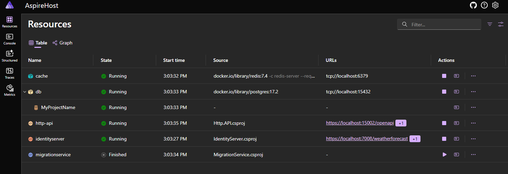
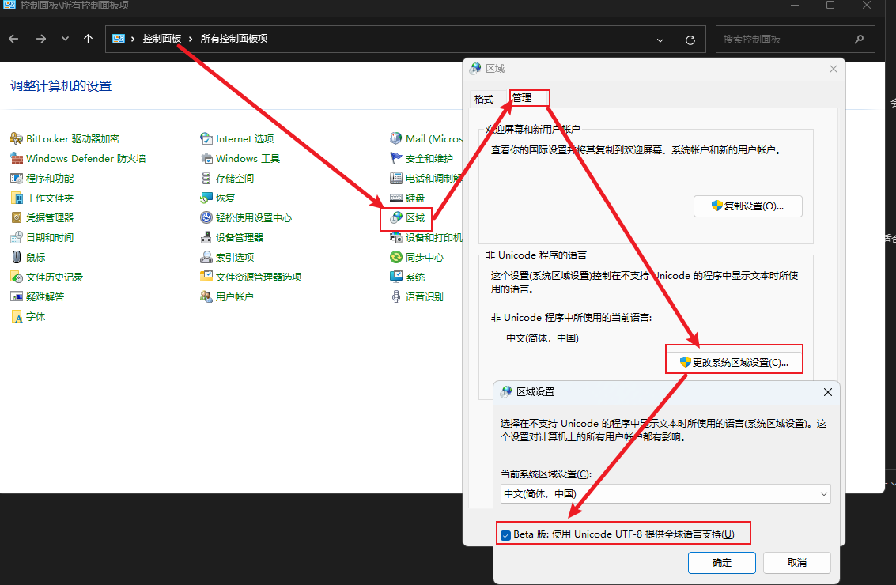

# 快速入门

本篇文章帮助您快速创建和运行项目。

## 前提条件

1. 安装`.NET 10`或更高版本的SDK。
2. 安装`Docker Desktop`或`Podman`。
3. IDE支持`.NET Aspire`组件。

具体要求请参考[.Net Aspire Setup](https://learn.microsoft.com/en-us/dotnet/aspire/fundamentals/setup-tooling?tabs=windows&pivots=visual-studio)。

## 创建项目

你可以下载模板`ater.web.template`，通过`dotnet new`来创建项目。

建议直接使用`Ater.dry.copilot`工具，在`Studio`中创建项目，这样可以通过UI界面创建和配置项目：

```powershell
dotnet tool --install Ater.dry.copilot --version 10.0.0
drycpl studio
```

命令执行后，会启动浏览器，点击创建解决方案，并填写相关内容后，等待创建成功。

使用IDE打开解决方案，解决方案已使用`.slnx`格式。

## 基础环境

我们首先准备本地开发环境，如缓存、数据库、消息队列等。

打开`AspireHost`下的`Program.cs`文件，可以看到，在创建项目时，已经根据你的配置，添加了对应的服务，在项目运行时，`.NET Aspire`会拉取对应服务的镜像，然后启动容器。

如果你是从模板中创建的项目，需要根据实际需要修改其中的代码。

## 检查配置

你需要检查服务配置是否符合实际情况，如:

- Http.API
- Migrations

打开项目下的`appsettings.Development.json`文件，检查并修改其中的配置，如缓存连接，数据库连接等内容。

## 创建数据库表结构

在正式运行程序前，我们要创建数据库表结构。

我们将使用`ef core`的迁移来创建数据库表结构。

在根目录`scripts`下，可调用`EFMigrations.ps1`脚本来执行数据库的迁移，如

```powershell
.\EFMigrations.ps1 Init
```

迁移生成的内容将在`Definition/EntityFramework/Migrations`目录下。

脚本默认指定对`CommandDbContext`数据库上下文生成迁移内容。

生成了迁移代码，然后我们就要执行迁移，创建数据库表结构。

### 使用MigrationService执行迁移

migrationService项目是一个`Worker Service`，它用来执行数据库迁移，或者添加初始数据等。该项目执行完成后，会自动退出。

请检查项目的配置文件中的数据库连接字符串是否正确。

可以单独运行此项目执行迁移，或者在`AspireHost`项目中运行。

## 运行项目

在服务层的项目，都是可以运行的项目，我们可以使用`dotnet run`或者`dotnet watch run`命令来运行项目，这适合单独运行某个项目的时候。

正常流程，我们需要启动`AspireHost`项目，然后我们会看到`Dashboard`的页面，在这里我们可以看到资源和服务的状态。



> [!TIP]
> 初次启动时，.NET Aspire会启动容器并下载镜像，需要等待一段时间，这是正常现象。

关于`Dashboard`的功能和使用，请参考[微软官方文档](https://learn.microsoft.com/en-us/dotnet/aspire/fundamentals/dashboard)。

> [!TIP]
> 如果你在.NET Aspire Console中遇到乱码问题，Windows的区域选项中，可设置使用UTF-8提供全球语言支持，如下图
> 

## 测试项目

为了确定项目配置是否正确，我们需要进行简单的测试。

### 数据迁移测试

在`Dashboard`中打开`Console`页面，然后查看`migrationService`的日志，看是否有报错信息。

如果运行成功，使用任意的数据库连接工具，连接到数据库，查看表结构是否创建成功。

### API测试

如果`Http.API`是`Running`状态，那么表示正常运行，我们先看一下`OpenAPI`是否正常，直接在浏览器输入`http://localhost:5002/openapi/admin.json`，查看是否能正常访问。

接下来我们来实际测试一下接口，在`Http.API`项目下有一个`Http.API.http`文件，在VisualStudio中，我们可以使用它来测试接口。打开该文件，然后从上到下依次点击`Send Request`，或者是叫发送请求，然后查看返回的结果是否正常。
