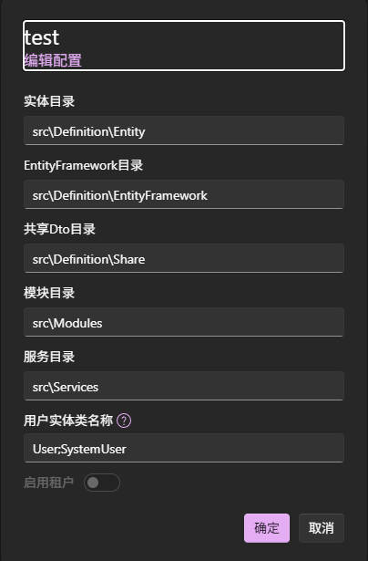

# 使用代码生成

接下来我们来见识一下代码生成的威力。本篇文档介绍如何使用代码生成功能，这里我们将通过使用`Studio WebUI`来完成相关的操作。

## 检查项目配置

通过模板创建的项目通常不需要额外的配置。保险起见，我们还是检查一下项目配置，并了解一下配置的含义。

使用`ater studio` 启动`Studio WebUI`，点击某个解决方案旁边的⚙️图标，打开配置弹窗：

以上主要是目录的配置，这意味着你不一定要使用原模板中的目录结构，你可以自定义目录结构，但要确保与配置中保持一致即可。

这里我们主要关注的是**用户实体类名称**，模板默认包含了`User`和`SystemUser`两个实体类，所以配置默认包含这两个实体名称。

你可以自行修改或添加其他用户实体名称，如`Account`。

> [!NOTE]
> "用户实体"指与身份验证相关的实体类，通常与数据权限有关，其标识使用`IUserContext`获取，在代码生成时会进行逻辑处理，所以需要与普通实体类区分出来。

## 生成DTO/Managers/Controllers

选择某个解决方案点击，进入工作台，我们将会看到实体列表。

这里我们选择`Blog`，执行`生成controller`的操作，等待生成完成。

这里提供了三个生成操作：

- 生成DTO：通过实体解析生成对应的DTO模型定义
- 生成Manager：生成包含基础CURD操作的Manager类，由于依赖DTO，所以需要先生成DTO。
- 生成Controller：生成包含基础CURD操作的Controller类，由于依赖Manager，所以需要先生成Manager。
