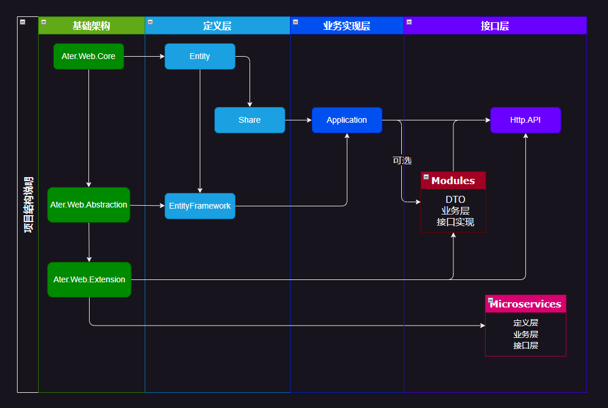

# 项目结构说明

## 根目录

- docs: 项目文档存储目录
- scripts： 项目脚本文件目录
- src：项目代码目录
- test：测试项目目录
- runtime：基于`.NETAspire`的开发环境集成
- .config：配置文件目录
- .dry-config.json 项目配置信息，当使用`dry cli`时需要该文件。

## 代码目录src

- Infrastructure 框架的基础定义，通常不需要关心，也不应该修改。
- Definition 定义层，先定义后实施，该目录主要是定义实体和DTO，以及ORM关系等。
  - Entity 基础核心类库，**`实体模型`** 定义所在项目，包括基础库的扩展，辅助类等。
  - Share 共享类库，**`DTO`** 定义所在项目，可在多个应用间共用的内容，如各类模型定义、通用配置、数据处理转换等，依赖 `Entity`。
  - EntityFramework `Entity Framework` 定义项目，依赖`Entity`。
- Application **`Manager`** 业务实现所在项目，包括各类服务。依赖 `Share`,`EntityFramework`。
- Http.API **`WebAPI`** 接口项目，定义和实现控制器逻辑，对外开放和运行的主程序，依赖`Application`。
  - ClienApp 集成的前端项目，使用`Angular`框架，可自行替换。
- Microservice 拆分可单独部署的应用，如微服务项目，通常依赖`Application`项目，以复用相关逻辑代码。
- Modules 模块目录。不同于拆分成单独的服务，模块的作用主要是实现关注点分离，它仍属于主服务的一部分。模块通常包括：
  - Models 接口所需要的DTO模型
  - Manager 该模块的业务实现逻辑
  - Controller 该模块定义或公开的接口

其结构图如下:

> [!NOTE]
> 这里不存在基于`模块`的开发，也没有这个概念。这里的模块是基于业务上的划分，将相应的业务实现在代码上进行拆分，实现关注点分离。
>
> 模块拥有自己的业务实现逻辑和API接口定义。它引用`Application`项目，以实现业务逻辑复用，并被`Http.API`主项目引用，统一公开接口访问。
>
> 模块的实体模型仍然在 Entity 项目中进行定义和管理

## 实践指导

`Entity` 只用来存放实体模型类，并且所有实体模型都应该放到该项目中。

`Http.API` 处理跟Web接口交互相关的内容，包括接口定义，请求、响应的验证和处理，权限认证等。所有数据为操作或业务逻辑，不应该放到该项目。

`Application` 项目主要用来实现业务逻辑，包括集成或调用的第三方接口或服务。
